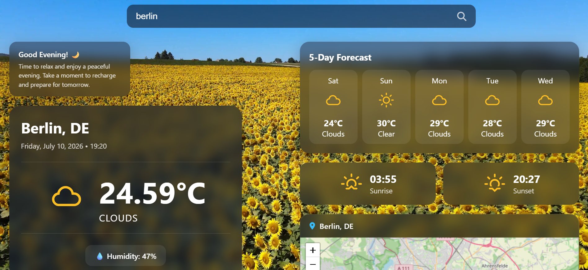
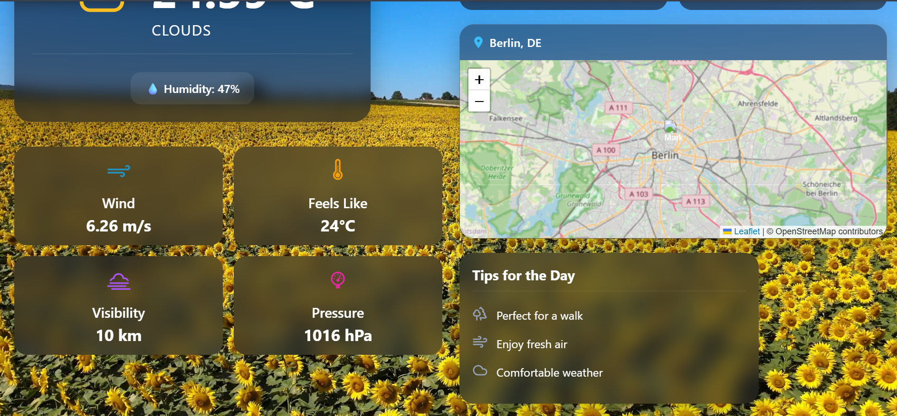

# 🌤️ Weatherly

A modern and responsive weather application built with **React** and **Vite** that provides accurate real-time weather information with a clean, interactive, and user-friendly interface.

## 🌐 Live Demo

🔗 https://weatherly-amina-app.netlify.app/

## 📖 About the Project

Weatherly allows users to search for any city worldwide and instantly access detailed weather information. The application combines an elegant design with practical weather data, making it simple and enjoyable to explore current conditions and upcoming forecasts.

## ✨ Features

- 🔍 Search weather by city name
- 🌍 Display city and country information
- 🌡️ Current temperature
- 🤗 Feels Like temperature
- 💧 Humidity
- 🌬️ Wind speed
- 📊 Atmospheric pressure
- 👁️ Visibility
- ☁️ Cloudiness
- 🌅 Sunrise & Sunset times
- 📅 5-Day Weather Forecast
- 🗺️ Interactive Weather Map
- 💡 Daily weather tips
- 🕒 Current date and time
- 🎨 Dynamic weather background
- ⏳ Loading animation while fetching data
- ❌ Error handling for invalid city names
- 📱 Fully responsive design for desktop, tablet, and mobile devices

## 🛠️ Technologies Used

- React
- Vite
- JavaScript (ES6+)
- CSS3
- OpenWeather API
- React Icons
- Leaflet
- OpenStreetMap

- ## 📸 Project Preview

### Home Page

### Weather Information

  
  

## 🔗 Links

- 🌐 Live Demo: https://weatherly-amina-app.netlify.app/
- 💻 GitHub Repository: https://github.com/aminaarmad/weather-app-react

## 👩‍💻 Author

**Amina**

Computer Science Student | Front-End Developer

If you like this project, don't forget to ⭐ star the repository!
